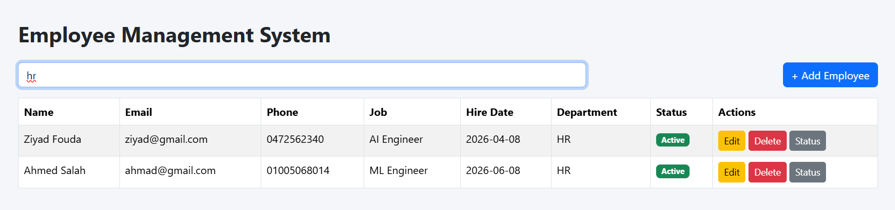
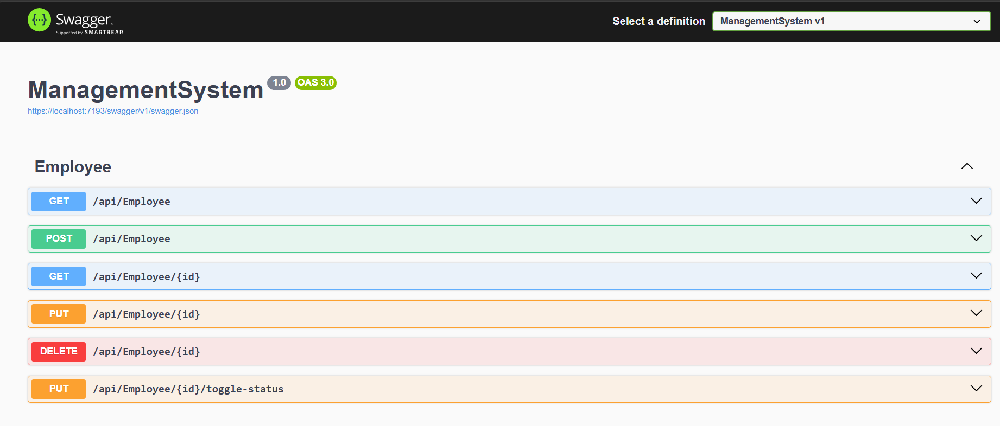
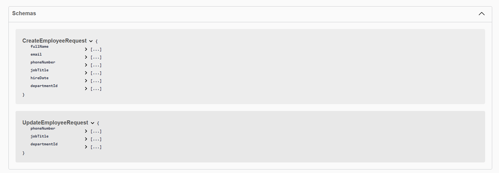

# Employee Management System API

A simple ASP.NET Core Web API for managing employees and departments.

## Features

- Create employees
- Update employee information
- Delete employees
- Get employee details
- Search employees by name or department
- Toggle employees status
- Employee validation
- Unique email constraint
- Department relationship using foreign keys

## Technologies Used

- ASP.NET Core Web API
- Entity Framework Core
- SQL Server
- FluentValidation
- Mapster
- C#

## Project Setup

### 1. Clone the repository

```bash
git clone <repository-url>
cd ManagementSystem
```

### 2. Configure Database Connection

Open:

```
appsettings.json
```

Update the connection string:

```json
{
  "ConnectionStrings": {
    "DefaultConnection": "Server=YOUR_SERVER;Database=ManagementSystem;Trusted_Connection=True;TrustServerCertificate=True"
  }
}
```

### 3. Restore Packages

Run:

```bash
dotnet restore
```

### 4. Database Setup

The project uses Entity Framework Core migrations.

Run:

```bash
dotnet ef database update
```

to create the database.

## Running the Project

### 1. Run the Backend API

Navigate to the backend project folder:

```bash
cd ManagementSystem
```

Restore packages:

```bash
dotnet restore
```

Apply database migrations:

```bash
dotnet ef database update
```

Run the API:

```bash
dotnet run
```

The API will start at:

```text
https://localhost:<port>
```

Make sure the API is running before starting the frontend.


### 2. Run the Frontend

Open another terminal and navigate to the frontend folder:

```bash
cd Frontend
```

Install dependencies:

```bash
npm install
```

Start the frontend:

```bash
npm run dev
```

## API Endpoints

### Employees

| Method | Endpoint | Description |
|------|----------|-------------|
| GET | `/api/employees` | Get all employees |
| GET | `/api/employees/{id}` | Get employee by ID |
| POST | `/api/employees` | Create employee |
| PUT | `/api/employees/{id}` | Update employee |
| DELETE | `/api/employees/{id}` | Delete employee |
| ToggleStatus | `/api/employees/{id}/toggle-status` | Employee toggle status |

## Search Employees

Search by employee name or department:

```
GET /api/employees?searchValue=badr
```

Example:

```
GET /api/employees?searchValue=hr
```

## Create Employee Example

Request:

```json
{
  "fullName": "Badr Younis",
  "email": "badr@gmail.com",
  "phoneNumber": "01017151157",
  "jobTitle": "Backend Developer",
  "hireDate": "2026-06-01",
  "departmentId": 1
}
```

## Update Employee Example

Only these fields can be updated:

```json
{
  "phoneNumber": "01017151157",
  "jobTitle": "Senior Backend Developer",
  "departmentId": 2
}
```

## Validation Rules

- Employee email must be unique
- Employee must belong to an existing department
- Required fields cannot be empty
- Hire date must be valid

## Database Relationships

- One Department has many Employees
- Each Employee belongs to one Department

```
Department
    |
    | 1 : Many
    |
Employee
```

## Notes

- API uses DTOs for requests and responses
- Mapster is used for object mapping
- FluentValidation handles request validation

## Screenshots

### Employees Page


### Create Employee


## Edit Employee


## Toggle Status


### Search


### API Endpoints


### API Schemas
